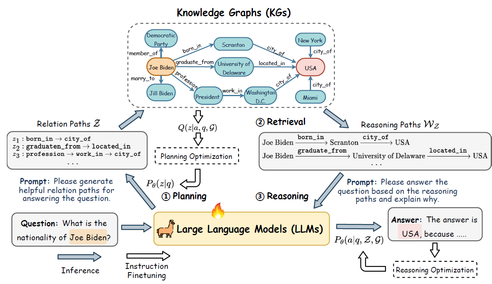
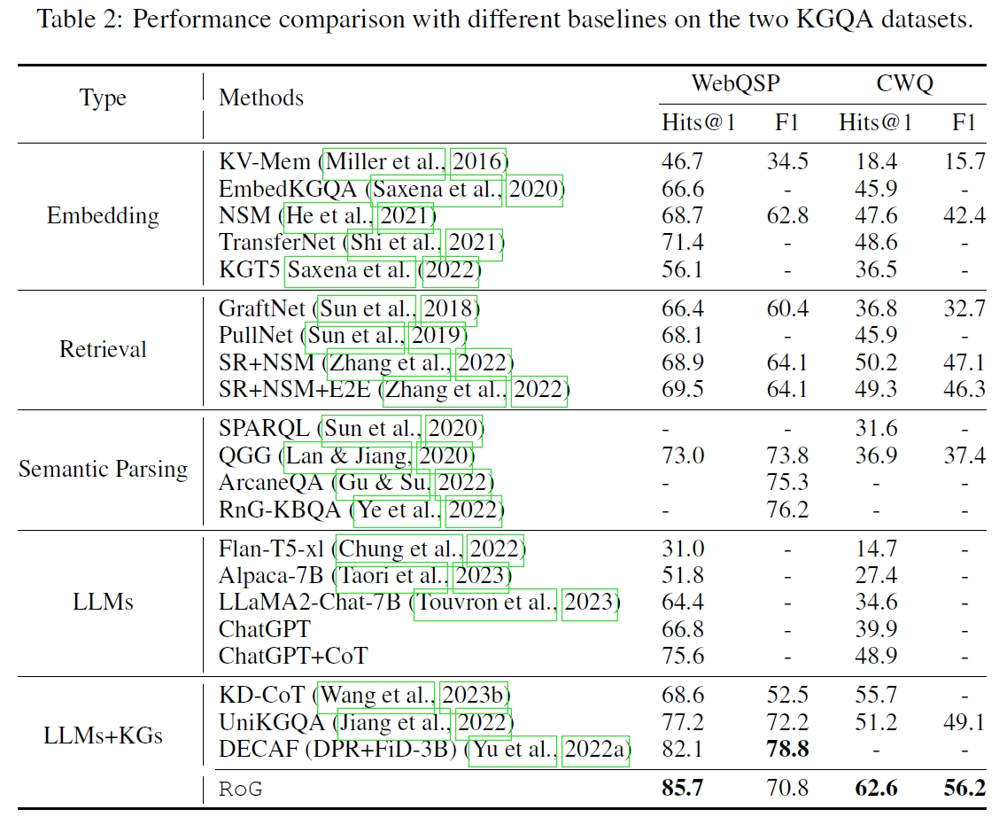
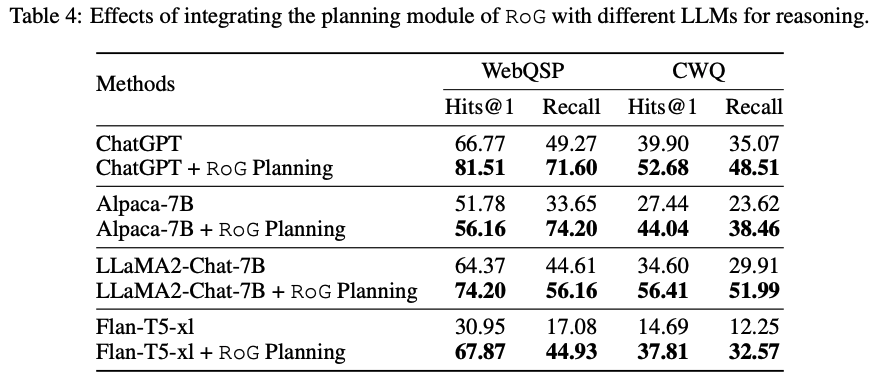
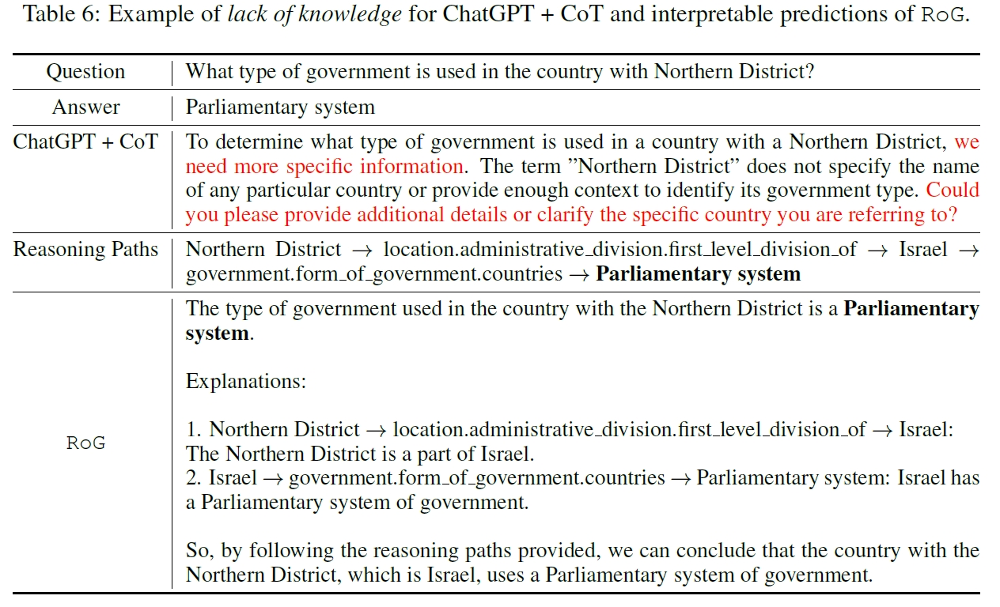
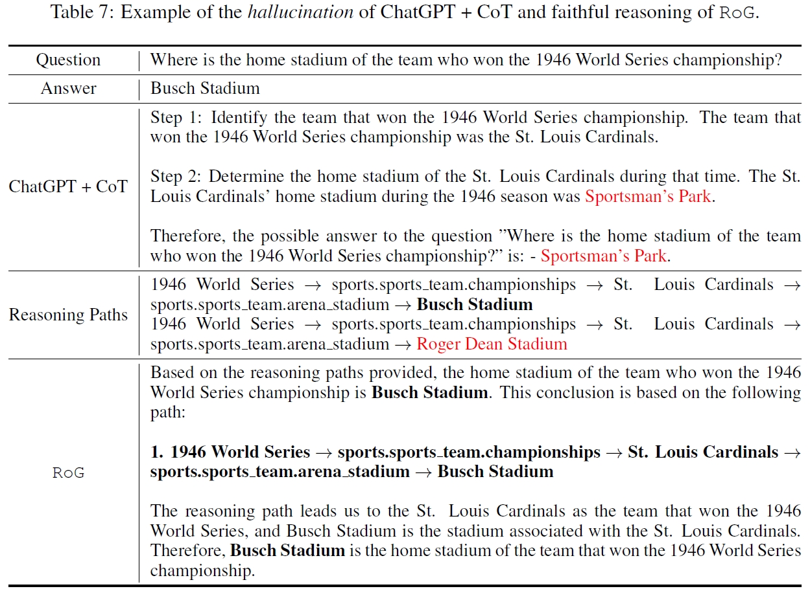

# Reasoning on Graphs (RoG)
Official Implementation of "[Reasoning on Graphs: Faithful and Interpretable Large Language Model Reasoning](https://arxiv.org/abs/2310.01061)".



Reasoning on graphs (RoG) synergizes LLMs with KGs to enable faithful and interpretable reasoning. We present a planning-retrieval-reasoning framework, where RoG first generates relation paths grounded by KGs as faithful plans. These plans are then used to retrieve valid reasoning paths from the KGs for LLMs to conduct faithful reasoning and generate interpretable results.

## News 🎉
Check out our latest work on KG + LLM reasoning: [Graph-constrained Reasoning](https://github.com/RManLuo/graph-constrained-reasoning) 

## Requirements
```
pip install -r requirements.txt
```

## Pre-trained weights

> Our code will automatically download the model weight from the huggingface.

You can find the pre-trained weights [here](https://huggingface.co/rmanluo/RoG).

## Datasets

> Our code will automatically download the data from the huggingface.

[RoG-WebQSP](https://huggingface.co/datasets/rmanluo/RoG-webqsp)   
[RoG-CWQ](https://huggingface.co/datasets/rmanluo/RoG-cwq)
<details> <summary>Subgraph Extraction</summary>

We extract the subgraphs from the Freebase following previous studies. The code can be found [here](https://github.com/RichardHGL/WSDM2021_NSM/tree/main/preprocessing/Freebase).   
</details>

## Inference
Requirements: Any GPU with at least 12GB memory.
### Step1: Planning (Generate relation paths)

Run: `./scripts/planning.sh`

```bash
python src/qa_prediction/gen_rule_path.py \
        --model_name RoG \
        --model_path rmanluo/RoG \
        -d {RoG-webqsp,RoG-cwq} \
        --split test \
        --n_beam 3
```

Generated rules will be saved at: `results/gen_rule_path/{dataset}/{model_name}/{split}`

### Step2: Reasoning (Generate answers with RoG)

Run: `./scripts/rog-reasoning.sh`

```bash
python src/qa_prediction/predict_answer.py \
        --model_name RoG \
        --model_path rmanluo/RoG \
        -d {RoG-webqsp,RoG-cwq} \
        --prompt_path prompts/llama2_predict.txt \
        --add_rul \
        --rule_path {rule_path} \
```

Answers will be saved at: `results/KGQA/{dataset}/{model_name}/{split}`

### Plug-and-play Reasoning (Generate answers with different LLMs)
>
> Note: you need to set your openai key at `.env` to use ChatGPT.

Run: `./scripts/plug-and-play.sh`

```bash
python src/qa_prediction/predict_answer.py \
        --model_name {gpt-3.5-turbo,alpaca,llama2-chat-hf,flan-t5} \
        -d {RoG-webqsp,RoG-cwq} \
        --prompt_path {prompt_path} \
        --add_rule \
        --rule_path {rule_path}
```
### Interpretable Reasoning
Run: `python scripts/interpretable_example.py`

```python
from transformers import pipeline, AutoTokenizer
import torch

MODEL_PATH_OR_NAME="rmanluo/RoG"

tokenizer = AutoTokenizer.from_pretrained(MODEL_PATH_OR_NAME, use_fast=False)
model = pipeline("text-generation", model=MODEL_PATH_OR_NAME, tokenizer=tokenizer, device_map="auto", torch_dtype=torch.float16)

print("====EXAMPLE 1: ====")

INPUT_TEXT_1 = """Based on the reasoning paths, please answer the given question and explain why 

Reasoning Paths: 
Northern District -> location.administrative_division.first_level_division_of -> Israel -> government.form_of_government.countries -> Parliamentary system

Question: 
What type of government is used in the country with Northern District?"""

outputs = model(INPUT_TEXT_1, return_full_text=False)
print(outputs[0]['generated_text'])
```

## Training

### Training Datasets
You can download the processed datasets from [RoG_train_data.tar.tz](datasets/RoG_train_data.tar.tz). Unzip the files and put them under `datasets/` folder.
<details> <summary>Process datasets</summary>

1. Build question to relation path pairs.

```bash
python src/align_kg/build_align_qa_dataset.py -d {RoG-webqsp,RoG-cwq} --split {train,validation,test}
```
2. Build joint-training datasets.

```bash
python src/joint_training/preprocess_align.py
python src/joint_training/preprocess_qa.py
```

3. Build interpretable examples.
```bash
python src/joint_training/generate_explanation_results.py
```

</details>

### Training RoG
2 A100-80GB GPUs are required for training RoG.

Run: `./scripts/train.sh`

## Results






## Bibinfo
If you found this repo helpful, please help us by citing this paper:
```
@inproceedings{luo2024rog,
title={Reasoning on Graphs: Faithful and Interpretable Large Language Model Reasoning},
author={Luo, Linhao and Li, Yuan-Fang and Haffari, Gholamreza and Pan, Shirui},
booktitle={International Conference on Learning Representations},
  year={2024}
}
```
